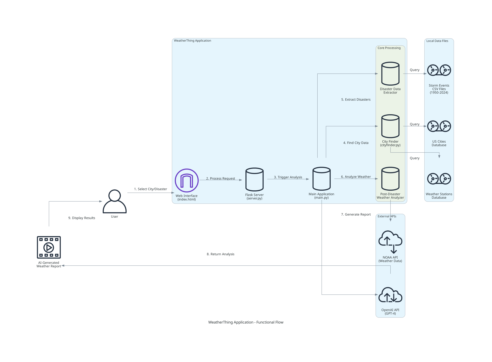

Conversation opened. 5 messages. 1 message unread.

Skip to content
Using Gmail with screen readers
1 of 1,100
Re: Document shared with you: "GT Essay.docx"
Inbox

Yang Chen
Sun, Nov 2, 3:20 PM (18 hours ago)
I am good with it. How is your Github repo preparation going? Repo1 DeepLabv3 notebook + version history record + detailed document Use chatgpt to convert the d
2

Yang Chen
Sun, Nov 2, 9:37 PM (12 hours ago)
Yep. No problem. I have a tool that can scan your code and generate the readme/diagram. No worries. It doesn't affect your GT application submission. No AO will

Yang Chen
Attachments
9:53 AM (6 minutes ago)
to Shen, me

Here are the README.md and functional diagram as we discussed for the Flank weather project.

1. Remember to put the diagram into the markdown document.
2. Remember to add the "license" info in the README.md
 2 Attachments
  •  Scanned by Gmail


# WeatherThing

A Python-based weather analysis application that studies weather patterns following natural disasters in specific US cities. The application combines historical storm data with real-time weather information to generate AI-powered scientific analysis reports.

## Architecture



## Features

- **Post-Disaster Weather Analysis**: Analyzes weather patterns in the 4 days immediately following natural disasters
- **Historical Storm Data Processing**: Uses NOAA's Storm Events Database (1950-2024)
- **Weather Station Integration**: Connects to NOAA's GHCND database via API
- **AI-Powered Reporting**: Uses OpenAI's GPT-4 to generate scientific analysis reports
- **Geographic Proximity Search**: Finds disasters within specified radius of target cities
- **City Selection**: Browse top cities by population in any US state

## Requirements

- Python 3.x
- API Keys:
  - NOAA API Key (for weather data)
  - OpenAI API Key (for report generation)

## Installation

1. Clone the repository:
```bash
git clone <repository-url>
cd weatherthing-main
```

2. Install dependencies:
```bash
pip install -r requirements.txt
```

3. Set up environment variables:
```bash
# Create a .env file with your API keys
NOAA_API_KEY=your_noaa_api_key_here
OPENAI_API_KEY=your_openai_api_key_here
```

## Usage

### Command Line Interface

Run the main application:
```bash
python main.py
```

The application will prompt you to:
1. Enter an event type (e.g., "Flash Flood", "Hurricane")
2. Enter a city name
3. Generate an AI analysis report

### Web Interface (Beta)

Start the web server:
```bash
python server.py
```

Visit `http://localhost:8080` in your browser.

**Note**: The web interface is currently in development and may not be fully functional.

## Data Sources

- **Storm Events Data**: NOAA Storm Events Database CSV files (1950-2024) in `/data/` directory
- **US Cities Database**: `uscities.csv` - Population and geographic data for US cities
- **Weather Stations**: `isd-history.csv` and `GHCND_stations.txt` - Weather monitoring station locations
- **Real-time Weather**: NOAA GHCND API for current weather measurements

## Core Components

### Main Scripts

- `main.py` - Main application entry point and report generation
- `server.py` - Flask web server (beta)
- `post_disaster.py` - Core analysis logic and NOAA API integration

### Processing Modules

- `cityfinder.py` - City selection and weather station matching
- `extract_disaster_data.py` - Historical disaster data extraction
- `snippettest.py` - Weather station utilities

### Utility Files

- `utility_files/downloader.py` - Data download utilities
- `utility_files/json_cache.py` - Caching functionality
- `utility_files/weather_data.json` - Cached weather data

## Configuration

### Analysis Parameters

- **Days After Storm**: Currently set to 4 days post-disaster
- **Search Radius**: 50km radius around target city (configurable)
- **Top Disasters**: Analyzes top 3 most significant disasters by impact score
- **Weather Metrics**: TMIN, TMAX, TAVG, PRCP, AWND, RHAV, SNWD

### Impact Scoring

Disasters are ranked by importance using:
```
Importance = Property Damage + Crop Damage + (Injuries × 50) + (Deaths × 1000)
```

## Example Output

The application generates scientific reports analyzing:
- Typical weather patterns following specific disaster types
- Consistency of post-disaster weather conditions
- Comparison with historical data
- Regional weather pattern analysis

## File Structure

```
weatherthing-main/
├── main.py                 # Main application
├── server.py              # Web server (beta)
├── post_disaster.py       # Core analysis logic
├── cityfinder.py          # City and station finder
├── extract_disaster_data.py # Disaster data extraction
├── requirements.txt       # Python dependencies
├── index.html            # Web interface
├── data/                 # Storm events CSV files (1950-2024)
├── recent_data/          # Recent storm data (2020-2024)
├── utility_files/        # Helper utilities
└── static/              # Web assets
```

## API Dependencies

### NOAA API
- **Endpoint**: `https://www.ncei.noaa.gov/cdo-web/api/v2/data`
- **Dataset**: GHCND (Global Historical Climatology Network Daily)
- **Rate Limits**: Apply as per NOAA API documentation

### OpenAI API
- **Model**: GPT-4
- **Usage**: Scientific report generation
- **Rate Limits**: Apply as per OpenAI API documentation

## Contributing

1. Fork the repository
2. Create a feature branch
3. Make your changes
4. Test thoroughly
5. Submit a pull request

## License

[Add your license information here]

## Disclaimer

This tool is for research and educational purposes. Weather analysis should be verified with official meteorological sources for any critical applications.
README.md
